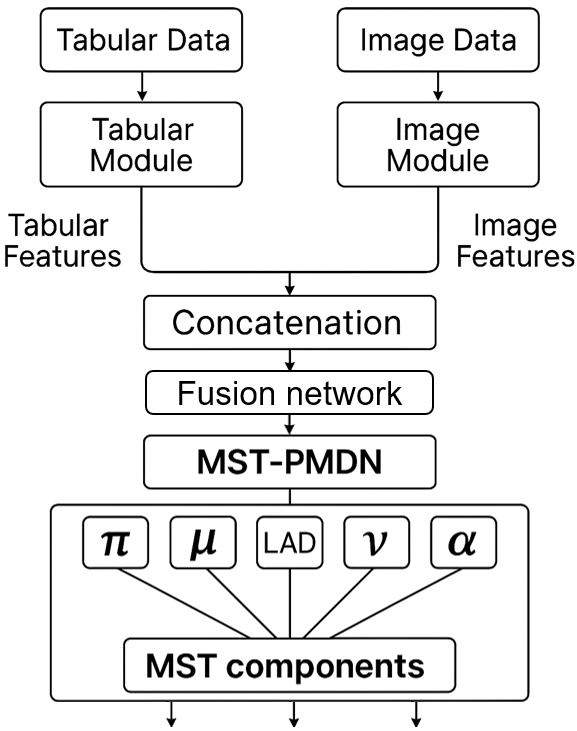

# Deep Multivariate Skew t-Parsimonious Mixture Density Network (MST-PMDN) 
### Alex J. Cannon <alex.cannon@ec.gc.ca> 

[torch for R](https://torch.mlverse.org/) implementation of a distributional regression model based on a multivariate skew t-Parsimonious Mixture Density Network (MST-PMDN). Parameters of a mixture of multivariate skew t distributions that describe a multivariate output are estimated by training a deep learning model with two multi-modal input branches, one for tabular inputs and the other for (optional) image inputs. The two branches are provided as user-defined modules. Outputs from each are concatenated and passed through a dense fusion network, which then leads to the MST-PMDN head. (Note: input and output variables should be scaled appropriately prior to model fitting.) Following the approach used in model-based clustering, scale matrices are represented using a volume (L)-shape (A)-orientation (D) (LAD) eigenvalue decomposition parameterization. LAD attributes, the degrees of freedom parameter (nu), and the alpha parameter (skewness, s) can be forced to be Variable or Equal between mixture components (plus Identity for A and D). Values of nu and alpha can also be constrained to emulate a multivariate normal (N) distribution. In the case of nu, users can specify fixed (F) values by passing an optional fixed_nu vector. If an element of fixed_nu is set to NA, then the value of nu for this component is learned by the network. Different model types are specified by setting the argument `constraint = "EIINN"`, `"VEVFV"`, etc. Values of the means (m), mixing coefficients (x), LAD attributes, nu (n), and alpha (skewness, s) for the mixtures can be made to be independent of inputs by specifying any combination of `constant_attr <- "m"`, `"mx"`, ..., `"LADmxns"`.

## References 

Ambrogioni, L., Güçlü, U., van Gerven, M. A., & Maris, E. (2017). The kernel mixture network: A nonparametric method for conditional density estimation of continuous random variables. arXiv:1705.07111. 
 
Andrews, J. L., & McNicholas, P. D. (2012). Model-based clustering, classification, and discriminant analysis via mixtures of multivariate t-distributions: the t EIGEN family. Statistics and Computing, 22, 1021-1029. 
 
Azzalini, A., & Capitanio, A. (2003). Distributions generated by perturbation of symmetry with emphasis on a multivariate skew t-distribution. Journal of the Royal Statistical Society Series B: Statistical Methodology, 65(2), 367-389. 
 
Andrews, J. L., Wickins, J. R., Boers, N. M., & McNicholas, P. D. (2018). teigen: An R package for model-based clustering and classification via the multivariate t distribution. Journal of Statistical Software, 83, 1-32. 
 
Banfield, J. D., & Raftery, A. E. (1993). Model-based Gaussian and non-Gaussian clustering. Biometrics, 803-821. 
 
Celeux, G., & Govaert, G. (1995). Gaussian parsimonious clustering models. Pattern Recognition, 28(5), 781-793. 

Falbel D., & Luraschi, J. (2025). torch: Tensors and Neural Networks with 'GPU' Acceleration. R package version 0.14.2, https://github.com/mlverse/torch, https://torch.mlverse.org/docs.

Fraley, C., & Raftery, A. E. (2002). Model-based clustering, discriminant analysis, and density estimation. Journal of the American Statistical Association, 97(458), 611-631. 
 
Fraley, C., & Raftery, A. E. (1998). How many clusters? Which clustering method? Answers via model-based cluster analysis. The Computer Journal, 41(8), 578-588. 
 
Lee, S., & McLachlan, G. J. (2014). Finite mixtures of multivariate skew t-distributions: some recent and new results. Statistics and Computing, 24, 181-202. 

Kingman, D. P., & Ba, J. (2015). Adam: a method for stochastic optimization. Proceedings of the 3rd International Conference on Learning Representations, ICLR 2015, San Diego, CA, USA. arXiv:1412.6980 

Klein, N. (2024). Distributional regression for data analysis. Annual Review of Statistics and Its Application, 11:321-346.

Peel, D., & McLachlan, G.J. (2000). Robust mixture modelling using the t distribution. Statistics and Computing 10, 339–348. 

Srucca, L., Fop, M., Murphy, T. B., & Raftery, A. E. (2016). mclust 5: Clustering, classification and density estimation using Gaussian finite mixture models. The R Journal, 8(1), 289-317. 
 
Williams, P. M. (1996). Using neural networks to model conditional multivariate densities. Neural Computation, 8(4), 843-854.

---

# Deep MST-PMDN Architecture

## Function Summaries

The implementation consists of several key functions and modules:

### Function: `t_cdf(z, nu, nu_switch = 20)`

*   **Purpose:** Calculates a differentiable *approximation* of the univariate Student's t cumulative distribution function (CDF).
*   **Method:** For `nu >= nu_switch`, transforms the input quantile `z` using a scaling factor derived from the degrees of freedom `nu`, then computes the standard normal CDF of the result using the error function (`erf`). Otherwise, uses `pt` from R and manually inserts a gradient for `z` into the computation graph and uses a finite difference approximation for `nu`. Alternatively, can numerically integrate a torch-compatible probability density function `t_pdf_int`, which will be faster on GPUs.
*   **Context:** Switches between the fast approximation and the slow `pt` (or numerical integration) calculation. Essential for the loss function's skewness calculation.

### Function: `sample_gamma(shape, scale, device)`

*   **Purpose:** Generates random samples from a Gamma distribution using `torch`.
*   **Method:** Wraps R's `rgamma` function, vectorizes it using `mapply`, and converts the output to a `torch` tensor on the specified device.
*   **Context:** Used within the `sample_mst_pmdn` function to generate the scaling variable needed for sampling from the t-distribution component of the skew-t.

### Function: `build_orthogonal_matrix(params, dim)`

*   **Purpose:** Constructs a batch of orthogonal matrices (representing rotation/orientation `D`).
*   **Method:** Uses the matrix exponential of a skew-symmetric matrix, where the input `params` parameterize the upper triangle of the skew-symmetric matrix.
*   **Context:** Used in the main model (`define_mst_pmdn`) to generate the orientation component `D` of the LAD decomposition when orientation is not fixed to the identity matrix.

### Function: `init_mu_kmeans(model, outputs_train, ...)`

*   **Purpose:** Initializes the component mean parameters (`mu`) using k-means clustering.
*   **Method:** Applies k-means to the training output data to find initial centroids. These centroids initialize either the `model$mu` parameters (if constant) or the bias of the `model$fc_mu` layer (if network-dependent), setting initial weights to zero.
*   **Context:** A heuristic to provide a potentially better starting point for training compared to random initialization, aiming for faster convergence.

### Module: `weight_norm_linear` (nn_module)

*   **Purpose:** Implements a linear layer with weight normalization.
*   **Method:** Decomposes the weight matrix `W` into a direction `V` and a magnitude `g`, learning these instead of `W` directly.
*   **Context:** Used for most linear layers within the network architecture (hidden layers and parameter prediction heads) to potentially improve training stability and convergence speed.

### Function: `init_weight_norm(module)`

*   **Purpose:** Initializes the parameters (`V`, `g`) of a `weight_norm_linear` layer.
*   **Method:** Uses Kaiming (He) normal initialization for the direction `V` and sets the initial magnitude `g` accordingly.
*   **Context:** Applied recursively to the model to ensure proper initialization of all weight-normalized layers.

### Module: `define_mst_pmdn(...)` (nn_module)

*   **Purpose:** Defines the main MST-PMDN neural network architecture.
*   **Method:**
    *   Processes optional image and tabular inputs through dedicated modules or uses raw inputs.
    *   Concatenates features and passes them through a hidden MLP using `weight_norm_linear` layers.
    *   Predicts mixture parameters (`pi`, `mu`, `L`, `A`, `D`, `nu`, `alpha`) using separate output heads (mostly `weight_norm_linear` or `nn_parameter` if constant).
    *   Applies constraints (Variable, Equal, Identity, Normal approx., Fixed) to parameters based on configuration.
    *   Constructs the full scale matrix `Sigma = L * D * diag(A) * D^T` and computes its Cholesky decomposition (`scale_chol`) for each component.
*   **Output:** Returns a list containing all mixture parameters (`pi`, `mu`, `scale_chol`, `nu`, `alpha`) and LAD components (`L`, `A`, `D`), batched appropriately.

### Function: `loss_mst_pmdn(output, target)`

*   **Purpose:** Computes the negative log-likelihood (NLL) loss.
*   **Method:**
    *   For each data point and mixture component `k`:
        *   Calculates residuals: `diff = target - mu_k`.
        *   Standardizes residuals: `v = scale_chol_k^{-1} * diff`.
        *   Calculates squared Mahalanobis distance: `maha = ||v||^2`.
        *   Calculates the log-PDF of the symmetric multivariate t-distribution part using `maha`, `log_det(Sigma_k)`, and `nu_k`.
        *   Calculates the skewness adjustment term `log(2 * T_CDF(alpha_k^T w, df=nu_k+d))`, where `w` is proportional to `v`, using `t_cdf`.
    *   Combines component log-densities using mixture weights `pi` via `logsumexp`.
    *   Returns the mean NLL over the batch.

### Function: `sample_mst_pmdn(mdn_output, num_samples, ...)`

*   **Purpose:** On-device generation of random samples from the predicted mixture distribution.
*   **Method:**
    *   Samples component indices based on `pi`.
    *   Gathers parameters for the selected components.
    *   Generates t-distribution scaling factors `W` using `sample_gamma`.
    *   Generates a *standard* multivariate skew-normal sample `X` based on the component's `alpha` (via `delta`).
    *   Transforms the standard sample `X` to the output space: `Y = mu_s + W * (scale_chol_s @ X)`.
*   **Output:** Returns a **list** with  
    *  `samples` - a torch tensor of shape `[S, B, d]`, where `S` is `num_samples`, `B` is the batch size (rows of the predictor matrix), and `d` is the response dimension.  
    *  `components` - a torch tensor of shape `[S, B]` giving the **1-based** component label (`1..G`) used for each draw.

### Function: `sample_mst_pmdn_df(mdn_output, num_samples, ...)`

*   **Purpose:** Generates random samples from the predicted mixture distribution and returns a formatted R data frame.
*   **Method:**
    *   Samples component indices based on `pi`.
    *   Gathers parameters for the selected components.
    *   Generates t-distribution scaling factors `W` using `sample_gamma`.
    *   Generates a *standard* multivariate skew-normal sample `X` based on the component's `alpha` (via `delta`).
    *   Transforms the standard sample `X` to the output space: `Y = mu_s + W * (scale_chol_s @ X)`.
*   **Output:** A data frame with `num_samples * batch_size` rows containing  
    *  simulated response variables in columns `V1 ... Vd`;  
    *  `row` - the index (`1..B`) of the predictor row that generated the draw;  
    *  `draw` - the draw number (`1..num_samples`) for that predictor row;  
    *  `comp` - a factor giving the 1-based component label (`1..G`).  

### Function: `train_mst_pmdn(...)`

*   **Purpose:** Manages the model training process.
*   **Method:** Includes data loading, model/optimizer setup (with k-means init), training loop (loss calculation, backpropagation, optimization), validation, learning rate scheduling, checkpointing, and early stopping. Handles optional image inputs correctly.
*   **Output:** Trained model, loss history, and training/validation indices.

### Function: `predict_mst_pmdn(model, new_inputs, ...)`

*   **Purpose:** Performs inference using the trained model.
*   **Method:** Runs a forward pass on new inputs in evaluation mode (`torch_no_grad()`).
*   **Output:** Raw model output list containing mixture parameters for the new inputs.

## Model, Loss, and Sampling Consistency

The core components – model definition (`define_mst_pmdn`), loss calculation (`mst_pmdn_loss`), and sampling (`sample_mst_pmdn`) – demonstrate consistency in their handling of the distribution parameters and transformations between different spaces.

*   **Spaces:**
    *   **Output Space:** The original space of the target variable `y` and component means `mu`. The full scale matrix `Sigma` (and its Cholesky factor `scale_chol`) are defined here.
    *   **Standardized Space:** A conceptual space for each component `k` obtained via whitening: `v = scale_chol_k^{-1} * (y - mu_k)`. Variables like `v`, `w` (in loss), and `X` (in sampling) primarily relate to this space.

*   **Model Output:** The model correctly outputs parameters (`mu`, `scale_chol`) defining the location and scale in the *output space*, along with shape (`nu`) and skewness (`alpha`) parameters.

*   **Loss Function:**
    *   Correctly calculates Mahalanobis distance (`maha`) using the standardized variable `v`.
    *   Calculates the symmetric t-distribution PDF using `maha`.
    *   **Key Point:** The skewness term `alpha_k^T w` implies that the learned `alpha` parameter operates on the *standardized* vector `w` (related to `v`). This means `alpha` defines skewness *after* the transformation by `scale_chol_k^{-1}`.
    *   Uses `t_cdf` for the CDF calculation required by the skewness term.

*   **Sampling Function:**
    *   Generates a *standard* skew-normal variable `X` (mean 0, identity scale) based on the learned `alpha`.
    *   Correctly transforms this standard variable `X` back into the *output space* using the scaling `W`, the Cholesky factor `scale_chol_s`, and the mean `mu_s`. This transformation `Y = mu_s + W * (scale_chol_s @ X)` is the inverse of the standardization performed in the loss function.
    *   The generation of `X` based on `alpha` followed by the transformation using `scale_chol_s` aligns with the loss function's interpretation of `alpha` operating in the standardized space.
